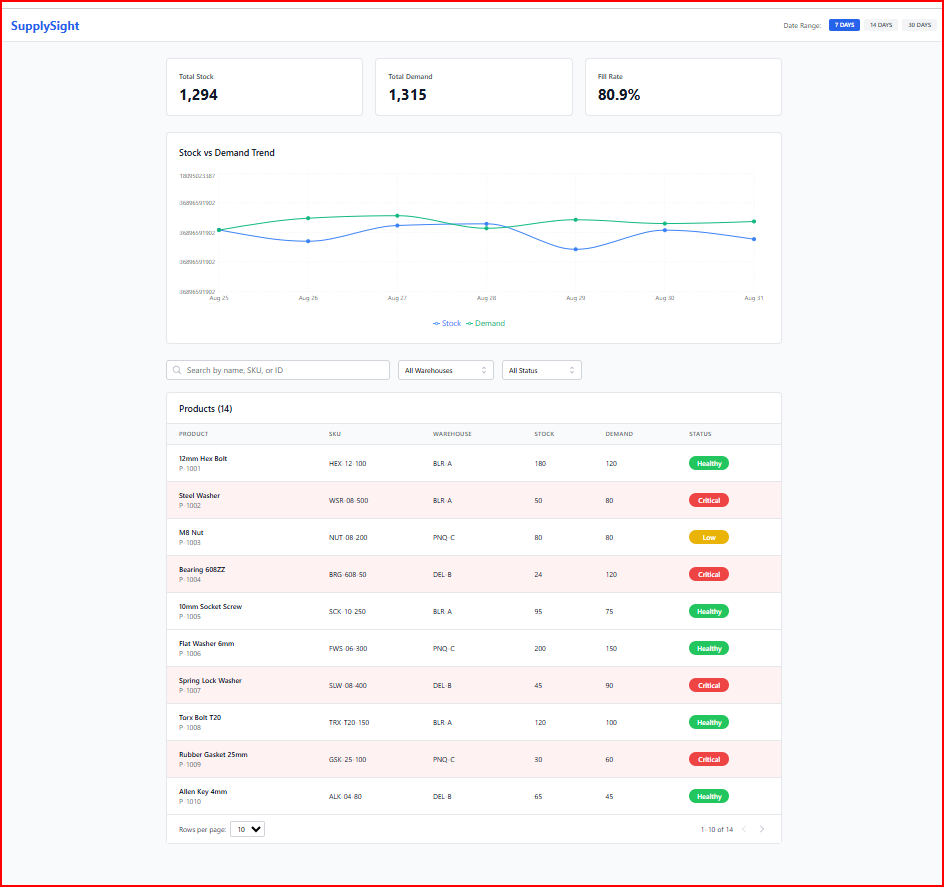
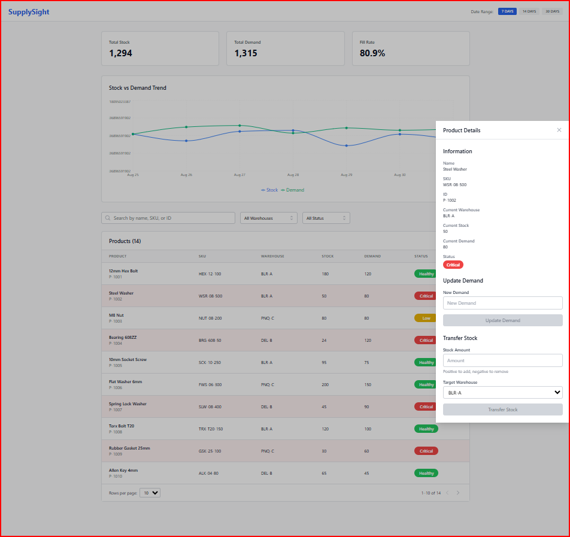

# Supply Sight Dashboard

A modern, responsive inventory management dashboard built with React, TypeScript, and Redux Toolkit. Features real-time data updates, interactive charts, and comprehensive product management capabilities.

## Features

### 📊 Dashboard Overview
- **Real-time KPI Cards**: Track total stock, demand, and fill rate with auto-updating calculations
- **Interactive Trend Chart**: Visualize stock vs demand trends over configurable time periods (7d, 14d, 30d)
- **Dynamic Data**: All metrics update automatically when product data changes

### 📦 Product Management
- **Interactive Product Table**: View all products with sortable columns and status indicators
- **Advanced Filtering**: Search by product name, SKU, or ID; filter by warehouse and status
- **Flexible Pagination**: Choose from 10, 25, or 50 rows per page with navigation controls
- **Status Management**: Visual status pills (Healthy/Low/Critical) based on stock vs demand ratios

### ✏️ Product Editing
- **Product Detail Drawer**: Modal interface for viewing and editing product information
- **Update Demand**: Modify product demand with form validation and real-time updates
- **Stock Transfer**: Add or remove stock using positive/negative values with warehouse selection
- **Smart Forms**: Auto-clearing forms with disabled states until valid input is provided

### 🎨 User Experience
- **Responsive Design**: Mobile-friendly interface built with Tailwind CSS
- **Real-time Updates**: All components react to data changes without page refreshes
- **Intuitive Navigation**: Clear visual hierarchy and user-friendly interactions
- **Accessibility**: Proper ARIA labels and keyboard navigation support

## Tech Stack

- **Frontend**: React 18.3.1, TypeScript 5.5.3
- **Routing**: React Router DOM 6.26.1
- **State Management**: Redux Toolkit 2.2.7, React Redux 9.1.2
- **UI Components**: Headless UI 2.1.2, React Hook Form 7.52.2
- **Styling**: Tailwind CSS 3.4.10, clsx 2.1.1
- **Charts**: Recharts 2.12.7
- **Icons**: Heroicons 2.1.5
- **GraphQL**: Apollo Client 3.11.4, GraphQL 16.9.0, GraphQL Tools Schema 10.0.6
- **Build Tool**: Vite 5.4.1
- **Testing**: Vitest 2.0.5, Testing Library (React 16.0.0, Jest DOM 6.4.8, User Event 14.5.2), jsdom 25.0.0
- **Development**: ESLint 9.9.0, TypeScript ESLint 8.0.1, PostCSS 8.4.41, Autoprefixer 10.4.20

## AI-Assisted Development

This project was developed with significant assistance from **Claude** (Anthropic's AI assistant) as part of exploring AI-powered software development workflows.

### Development Process
- **Architecture Design**: Claude helped design the Redux state management structure and component hierarchy
- **Code Generation**: Major components, TypeScript interfaces, and test suites were generated with Claude's assistance
- **Problem Solving**: Complex features like real-time KPI calculations, form validation, and chart integration were implemented through AI-human collaboration
- **Testing**: Comprehensive test coverage including unit tests, integration tests, and Redux state testing was created with AI assistance
- **Documentation**: This README, code comments, and technical documentation were generated and refined with Claude

### AI-Generated Features
- **Product Management System**: Complete CRUD operations with form validation
- **Real-time Data Visualization**: Interactive charts with live data updates
- **Advanced Filtering & Pagination**: Dynamic table with search and filtering capabilities  
- **Status Management**: Automated status calculation and visual indicators
- **Responsive UI**: Mobile-friendly design with Tailwind CSS
- **Type Safety**: Comprehensive TypeScript definitions and interfaces

### Human-AI Collaboration Benefits
- **Rapid Prototyping**: Quickly iterated through different approaches and implementations
- **Best Practices**: Ensured modern React patterns, accessibility, and performance optimizations
- **Code Quality**: Maintained consistent code style, proper error handling, and comprehensive testing
- **Documentation**: Generated clear, detailed documentation and code comments

### Learning Outcomes
This project demonstrates the potential of AI-assisted development for:
- Accelerating feature development while maintaining code quality
- Exploring modern web development patterns and best practices
- Creating comprehensive test coverage and documentation
- Building complex, interactive user interfaces with real-time data

*The collaboration between human oversight and AI capabilities resulted in a production-ready application with modern architecture, comprehensive testing, and detailed documentation.*

## Screenshots

### Main Dashboard


### Product Detail Drawer


## Getting Started

### Prerequisites

- Node.js 20.19.4
- npm or yarn

### Installation

1. Clone the repository
```bash
git clone <repository-url>
cd supplysight-dashboard
```

2. Install dependencies
```bash
npm install
```

3. Start the development server
```bash
npm run dev
```

4. Open [http://localhost:5173](http://localhost:5173) to view it in the browser

### Available Scripts

```bash
# Start development server
npm run dev

# Build for production
npm run build

# Preview production build
npm run preview

# Run tests
npm test

# Type checking
npm run typecheck

# Lint code
npm run lint
```

## Project Structure

```
src/
├── components/          # React components
│   ├── __tests__/      # Component tests
│   │   ├── Filters.test.tsx
│   │   ├── KPICards.test.tsx
│   │   ├── ProductDrawer.test.tsx
│   │   ├── ProductsTable.test.tsx
│   │   ├── TopBar.test.tsx
│   │   └── TrendChart.test.tsx
│   ├── common/         # Shared utilities
│   │   └── util.ts     # Common functions (status badges, etc.)
│   ├── Filters.tsx     # Search and filter controls
│   ├── KPICards.tsx    # Key performance indicators
│   ├── ProductDrawer.tsx # Product detail drawer with forms
│   ├── ProductsTable.tsx # Main products table with pagination
│   ├── TopBar.tsx      # Navigation header
│   └── TrendChart.tsx  # Stock vs demand chart
├── data/               # Mock data and generators
│   └── mockData.ts     # Product mock data
├── hooks/              # Custom React hooks (empty)
├── services/           # API service layer
│   ├── __tests__/      # Service tests
│   │   └── graphql.test.ts
│   └── graphql.ts      # GraphQL client and schema
├── store/              # Redux store and slices
│   ├── __tests__/      # Store tests
│   │   ├── productsSlice.test.ts
│   │   └── uiSlice.test.ts
│   ├── index.ts        # Store configuration and selectors
│   ├── productsSlice.ts # Product state management
│   └── uiSlice.ts      # UI state management
├── test/               # Test utilities and setup
│   ├── setup.ts        # Test environment setup
│   └── test-utils.tsx  # Redux-aware test utilities
├── types/              # TypeScript definitions
│   └── index.ts        # Type definitions
├── App.tsx             # Root component
└── main.tsx           # Application entry point
```

## Data Model

The application manages product inventory with the following key entities:

### Product
```typescript
interface Product {
  id: string;          // Unique identifier
  name: string;        // Product name
  sku: string;         // Stock keeping unit
  warehouse: string;   // Storage location
  stock: number;       // Current stock level
  demand: number;      // Demand forecast
}
```

### Status Calculation
- **Healthy**: Stock > Demand (green)
- **Low**: Stock = Demand (yellow)  
- **Critical**: Stock < Demand (red)

## State Management

The application uses Redux Toolkit with two main slices:

### Products Slice
- Manages product data, status calculations, and KPI metrics
- Handles product updates and real-time recalculations
- Provides selectors for filtered and paginated data

### UI Slice  
- Controls application UI state (filters, pagination, drawer)
- Manages user preferences and navigation state
- Handles form state and user interactions

## Testing

Comprehensive test suite covering:
- **Unit Tests**: Individual component functionality
- **Integration Tests**: Component interactions with Redux store
- **Form Tests**: Validation and submission workflows
- **State Tests**: Redux slice reducers and actions

Run tests with:
```bash
npm test                 # Run all tests
```

## Mock Data

The application includes realistic mock data with:
- 14 diverse hardware products
- Varied stock levels and demand patterns
- Multiple warehouses (BLR-A, PNQ-C, DEL-B)
- Different status distributions for testing

## Development Notes

### Form Management
- Uses React Hook Form for validation and state management
- Implements disabled button states until valid input
- Auto-clears forms after successful submissions
- Supports both positive and negative stock adjustments

### Real-time Updates
- All components subscribe to Redux store changes
- KPI cards recalculate automatically on data updates
- Charts reflect current totals as today's data point
- Status indicators update based on stock/demand ratios

### Performance
- Memoized selectors prevent unnecessary re-renders
- Lazy loading for improved initial load times
- Optimized re-renders using React.memo where appropriate

## Browser Support

- Chrome (latest)
- Firefox (latest)
- Safari (latest)
- Edge (latest)

## Contributing

1. Fork the repository
2. Create a feature branch (`git checkout -b feature/amazing-feature`)
3. Commit your changes (`git commit -m 'Add some amazing feature'`)
4. Push to the branch (`git push origin feature/amazing-feature`)
5. Open a Pull Request

## License

This project is licensed under the MIT License - see the [LICENSE](LICENSE) file for details.